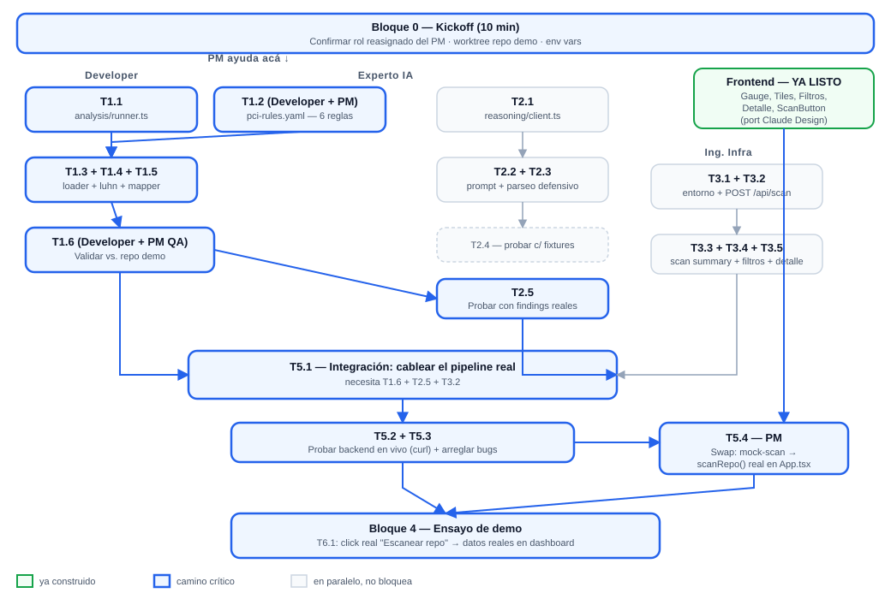

# EDT — IONIX Sentinel (medio día, 4 personas)

> **Actualizado tras revisar el estado real de `develop`** (PR "Port Claude Design dashboard" ya mergeado). El frontend quedó prácticamente terminado — el 100% del trabajo que falta hoy es backend.
> Referencias: [epicas-historias.md](https://github.com/matiasua/Ionix-sentinel/blob/develop/docs/epicas-historias.md) · [07-backend-spec.docs.md](https://github.com/matiasua/Ionix-sentinel/blob/develop/docs/07-backend-spec.docs.md) · [06-frontend-spec.docs.md](https://github.com/matiasua/Ionix-sentinel/blob/develop/docs/06-frontend-spec.docs.md)

## Lo que ya está hecho — no hay que tocarlo ni redecidirlo

**Scaffold (de antes):**
- Docker Compose con `frontend`/`backend`/`postgres` — levanta con `docker compose up --build`.
- Tabla `findings` en Postgres migrada al contrato final; esquema `Finding` en `backend/src/types/finding.ts`.
- `GET /api/findings` y `POST /api/findings` funcionan.
- Repo de práctica `pci-dss-vulnerable-demo` (rama `pci-vulnerable-demo`) referenciado como `../Ionix-sentinel-demo`.

**Frontend (nuevo — recién descubierto en `develop`):**
- **Todos** los componentes de `06-frontend-spec.docs.md` §3 ya existen: `RiskScoreGauge` (gauge de arco animado, más pulido que lo planeado originalmente), `SeverityTiles`, `ScanButton`, `FilterBar`, `CodeSnippet`, `StatusSelect`, `States` (loading/empty/error), `Toast`, `SeverityBadge`.
- Las 3 vistas completas ya existen: `DashboardResumen`, `FindingsList` (con filtros), `FindingDetail` (con snippet + explicación + remediación). Incluso hay vistas extra de Logs/Config que no eran parte del alcance de hoy.
- El botón de escaneo **ya funciona de punta a punta con datos simulados**: `startScan()` en `App.tsx` anima una barra de progreso y después inserta los findings de `frontend/src/mocks/findings.ts` vía el `POST /api/findings` real, evitando duplicados por `ruleId+filePath+lineNumber`. O sea: el dashboard ya muestra datos reales en Postgres hoy mismo, solo que no vienen de un análisis real todavía.

**Conclusión: el frontend no necesita más construcción hoy.** Lo único frontend que falta es una integración chica (ver T5.4 abajo), no nuevas vistas ni componentes.

## Corte de alcance para hoy

- **Fase 2 (logs, Épicas B4/F5) fuera por completo** — y ojo: las vistas de Logs/Config que ya existen en el frontend no están conectadas a datos reales; **no mostrarlas en la demo**, para no dar a entender que Fase 2 está lista.
- De las 10-12 reglas PCI-DSS planeadas, la meta sigue siendo **6 reglas hoy** (lista en T1.2) — con la ventaja de que ahora hay más manos libres para ayudar a escribirlas y probarlas (ver "Dueños" abajo).
- `VULN-002` (PAN en migración `.sql`) queda como gap conocido: el analizador es de un solo lenguaje (TS/TSX).
- Vulnerabilidades de control de acceso / masking (`VULN-006`, `VULN-010`) no se detectan con reglas de patrón simple — quedan fuera del analizador automático hoy.
- Sin autenticación, multi-usuario ni pulido visual adicional (ya está más que resuelto por el port de Claude Design).

## Dueños (revisado — todo el trabajo restante es backend)

| Rol | Qué construye | Carpeta/archivos |
|---|---|---|
| Developer | Analizador Estático (Épica B1) | `backend/src/analysis/`, `backend/src/rules/` |
| Experto IA | Motor de Razonamiento (Épica B2) | `backend/src/reasoning/` |
| Ing. Infra | Orquestación + API (Épica B3) | `backend/src/routes/scan.routes.ts`, extender `findings.routes.ts`, `.env` |
| PM | Ver abajo — ya no construye UI | — |

**PM: rol reasignado.** Como el frontend está terminado, el PM tiene más valor hoy ayudando a destrabar el cuello de botella real (las reglas del Developer) que construyendo UI que ya existe:
1. Pair con Developer en `rules/pci-rules.yaml`: ayudar a escribir/ajustar patrones y a compararlos contra `findings-expected.json` — no requiere backend profundo, es leer el repo demo y afinar regex.
2. Dueño de la integración final T5.4 (cambiar `startScan()` para llamar al `POST /api/scan` real en vez de insertar `mocks/findings.ts`).
3. QA: comparar los findings reales que produzca el pipeline contra `findings-expected.json` (precisión/recall) antes del ensayo.
4. Guion de demo + registrar ejemplos de uso de Claude Code (igual que antes).

Con esta ayuda extra, es razonable apuntar a más de 6 reglas hoy si el tiempo alcanza (ver P1.4).

## Dependencias entre tareas

El camino crítico sigue siendo la cadena del Developer (T1.1 → T1.6) — pero ahora el PM ayuda directamente ahí en vez de estar en un camino aparte, así que el cuello de botella se destraba más rápido. Experto IA e Ing. Infra siguen pudiendo construir y probar sus piezas en paralelo con fixtures/mocks, sin esperar a nadie. El único punto de convergencia real sigue siendo `T5.1` (backend) y ahora también `T5.4` (el swap del mock-scan por el scan real en el frontend, que es chico).

## Bloque 0 — Kickoff (10 min, los 4 juntos)

- [ ] Confirmar la tabla de dueños de arriba (especialmente el rol reasignado del PM).
- [ ] Confirmar el corte de alcance en voz alta — sobre todo: **no mostrar las vistas de Logs/Config en la demo**.
- [ ] Developer/Experto IA/Infra abren `07-backend-spec.docs.md`. PM revisa rápido `frontend/src/mocks/findings.ts` y `App.tsx::startScan()` para entender qué hay que reemplazar en T5.4.
- [ ] Confirmar que el worktree `../Ionix-sentinel-demo` (rama `pci-vulnerable-demo`) está creado localmente por quien lo necesite.
- [ ] Confirmar `ANTHROPIC_API_KEY` en el `.env` de quien lo necesite (Experto IA, Infra).
- [ ] PM: abrir una nota para ir registrando ejemplos de uso de Claude Code (pesa 30 pts en la evaluación).

## Bloque 1 — Build en paralelo, P0 (≈100 min)

### Developer + PM — Analizador Estático (`backend/src/analysis/`, `backend/src/rules/`)

- [ ] **T1.1 — `analysis/runner.ts` (HU-B1.1).** Exportar `runSemgrep(path: string): SemgrepMatch[]`. Corre `semgrep --config backend/src/rules/pci-rules.yaml --json <path>` con `execSync`/`spawnSync`, parsea el `stdout` con `JSON.parse` (nunca descartarlo sin revisar). Antes de correr, chequear `fs.existsSync(path)`; si no existe o `semgrep` no está instalado (`ENOENT`), lanzar un error controlado y legible.

- [ ] **T1.2 — `rules/pci-rules.yaml` con 6 reglas (HU-B1.2). PM ayuda acá.** Cada regla: `id`, `pciRequirement`, `title`, `severity`, `detector` (`semgrep`|`regex`), `pattern`, `luhn` si aplica. Las 6 de hoy:
  - `PCI-SECRET-HARDCODED` (8.6.2) — regex credenciales/keys → `VULN-001`, `VULN-009`, `VULN-005`.
  - `PCI-PAN-CVV-LOGGED` (3.4.1) — `console.log`/`console.error` con `pan`/`cvv` → `VULN-003a`, `VULN-008b`, `VULN-016`, `VULN-017`.
  - `PCI-SQL-INJECTION` (6.2.4) — template string interpolado en `query()` → `VULN-003b`.
  - `PCI-WEAK-CRYPTO` (3.6.1) — `aes-128-ecb` u otro modo débil → `VULN-004`.
  - `PCI-INSECURE-STORAGE-CLIENT` (3.3) — `localStorage.setItem` con `pan`/`cvv` → `VULN-008a`.
  - `PCI-NO-TLS` (4.2.1) — `ssl: false` → `VULN-011`.
  - PM puede escribir los patrones regex y probarlos a mano contra los archivos del repo demo mientras Developer arma `runner.ts`/`loader.ts`, y después juntarlos.

- [ ] **T1.3 — `rules/loader.ts`.** `loadRules(filePath): Rule[]` con `js-yaml`; validar que cada regla tenga `id`, `pciRequirement`, `pattern`.

- [ ] **T1.4 — `analysis/luhn.ts` (HU-B1.3).** `isValidLuhn(candidate: string): boolean`, algoritmo estándar. Se aplica solo a matches con `luhn: true`.

- [ ] **T1.5 — `analysis/mapper.ts` (HU-B1.4).** `mapMatchToFinding(match, rule): CreateFindingInput` — arma `ruleId`, `pciRequirement`, `title`, `severity`, `source: "code"`, `filePath`, `lineNumber`, `snippet`.

- [ ] **T1.6 — Validar contra el repo demo (HU-B1.5). PM ayuda con el QA.** Correr `runSemgrep("../Ionix-sentinel-demo")` y comparar contra `findings-expected.json`: ¿cuántos `real_violations` matchean?, ¿algún `negative_control` (Luhn inválido, PAN enmascarado, cifrado fuerte) generó finding por error? Ajustar hasta que sea razonable.

### Experto IA — Motor de Razonamiento (`backend/src/reasoning/`)

- [ ] **T2.1 — `reasoning/client.ts` (HU-B2.1).** `new Anthropic({ apiKey: process.env.ANTHROPIC_API_KEY })`, modelo `claude-sonnet-5`. Exportar `enrichFinding(raw: CreateFindingInput): Promise<{explanation, remediation, severity}>`.
- [ ] **T2.2 — `reasoning/prompt.ts` (HU-B2.1).** Prompt explícito: "este hallazgo ya fue determinado por el motor de reglas — solo enriquecer, no decidir". Incluir `ruleId`, `pciRequirement`, `title`, `severity` base, `snippet`. Pedir JSON con `explanation`/`remediation` en español.
- [ ] **T2.3 — `reasoning/parse.ts` (HU-B2.2 / HU-B2.3).** Parseo defensivo del bloque `{...}` + validación de schema; si falla, `reasoningStatus: "error"` sin romper el pipeline.
- [ ] **T2.4 — Probar con fixtures.** Antes de que el analizador tenga output real, probar con 2-3 findings de `findings-expected.json`.
- [ ] **T2.5 — Probar con findings reales.** En cuanto el analizador tenga output real (T1.6), correr el enriquecimiento y ajustar el prompt.

### Ing. Infra — Orquestación + API (`backend/src/routes/`)

- [ ] **T3.1 — Confirmar entorno.** `.env` completo, `docker compose up --build` limpio, `GET /api/health` en verde.
- [ ] **T3.2 — `routes/scan.routes.ts` → `POST /api/scan` (HU-B3.5).** Recibe `{ path }`, genera `scanId`, corre `runSemgrep` → Luhn → `mapMatchToFinding` → `enrichFinding` por cada uno → `INSERT` con ese `scan_id`. Responde `{ scanId, findingsCount, riskScore }`.
- [ ] **T3.3 — `GET /api/scans/:id` (HU-B3.4).** Conteos por severidad + `riskScore = 10*critical + 5*high + 2*medium + 1*low`.
- [ ] **T3.4 — Filtros en `GET /api/findings` (HU-B3.1).** `severity`, `source`, `status`, `scanId` vía query params, parametrizados.
- [ ] **T3.5 — `GET /api/findings/:id` (HU-B3.2).**
- [ ] (ya no es necesario construir el frontend para esto — `FindingDetail.tsx` y `FilterBar.tsx` ya existen y están listos para consumirlo.)

## Bloque 2 — Integración end-to-end (≈45-60 min, los 4 juntos)

- [ ] **T5.1 — Cablear el pipeline real.** Dentro de `scan.routes.ts`: `runSemgrep` + Luhn + `mapMatchToFinding` (Developer) → `enrichFinding` (Experto IA), en ese orden. Infra lidera.
- [ ] **T5.2 — Probar el backend en vivo (sin frontend todavía).** `curl -X POST http://localhost:3000/api/scan -d '{"path":"../Ionix-sentinel-demo"}'` y confirmar que devuelve `scanId`/`findingsCount`/`riskScore` coherentes.
- [ ] **T5.3 — Arreglar bugs de integración backend.** Nombres de campos, timeouts de Claude (considerar limitar cuántos findings se enriquecen en la demo si son muchos).
- [ ] **T5.4 — PM: reemplazar el mock-scan por el scan real.** En `frontend/src/App.tsx`, dentro de `startScan()`: en vez de insertar `mocks/findings.ts` vía `createFinding`, agregar `scanRepo(path)` a `api/client.ts` (`POST /api/scan`) y llamarla ahí. El resto de la función (animación de progreso, `getFindings()` al final, `showToast`) se puede dejar casi igual.
- [ ] **T5.5 — Probar el flujo completo en el navegador.** Click en "Escanear repo" real → dashboard con datos reales del repo demo.

## Bloque 3 — P1 si sobra tiempo (≈30 min)

La mayoría de lo que era P1 (filtros, detalle, `StatusSelect`) **ya está construido** en el frontend. Lo único P1 real que queda:

- [ ] **P1.1 — `PATCH /api/findings/:id`.** El frontend (`StatusSelect.tsx`) ya está listo para consumirlo, solo falta el endpoint.
- [ ] **P1.2 — Reglas adicionales.** Con PM ayudando desde el Bloque 1, apuntar a 2-4 reglas extra sobre las 6 base: `PCI-PAN-QUERYSTRING` (4.2.1, → `VULN-007`), `PCI-VERBOSE-ERROR` (6.2.4, → `VULN-012`).

## Bloque 4 — Ensayo de demo (≈20-30 min, los 4 juntos)

- [ ] **T6.1 — Ensayo completo.** Click en "Escanear repo" → findings reales en la lista → risk score real en el dashboard. **No navegar a las vistas de Logs/Config.**
- [ ] **T6.2 — Plan B.** Si el scan en vivo falla, tener ya corrida una vez antes y los datos persistidos en Postgres (no se pierden con `docker compose down` sin `-v`).
- [ ] **T6.3 — Cerrar notas de Claude Code.** PM recopila 3-5 ejemplos concretos para la presentación.
- [ ] **T6.4 — Mensaje de negocio + gaps honestos.** Costo de incumplimiento PCI-DSS para IONIX, y respuesta lista si preguntan por `VULN-002` o control de acceso.

## Ajustar los tiempos

Los minutos son referencia para ~4 horas totales. Con el frontend ya resuelto, hay más margen del que parecía — usarlo para sumar reglas (P1.2) o para un ensayo más largo, no para dejar de hacerlo.
